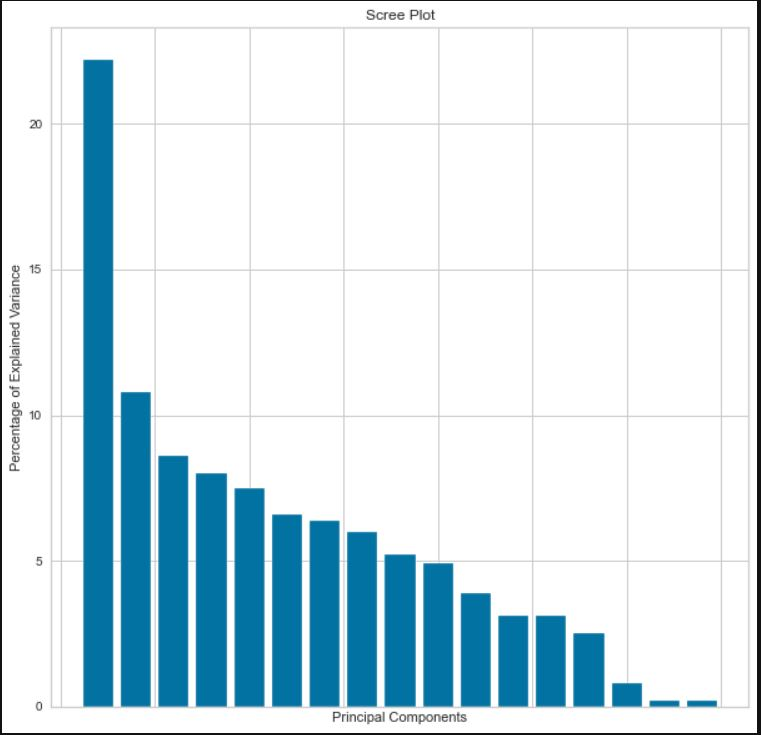
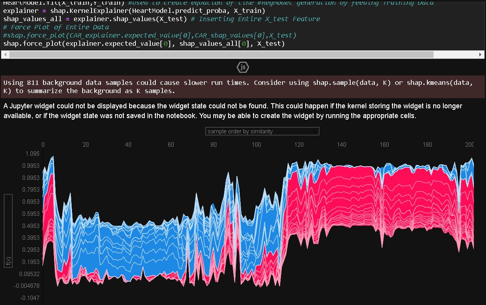
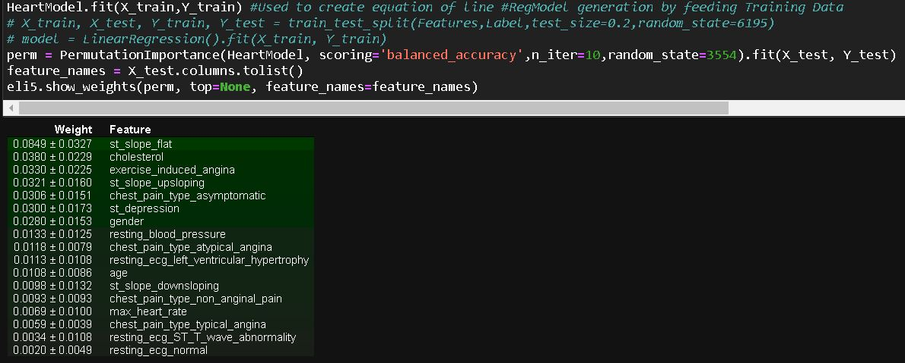
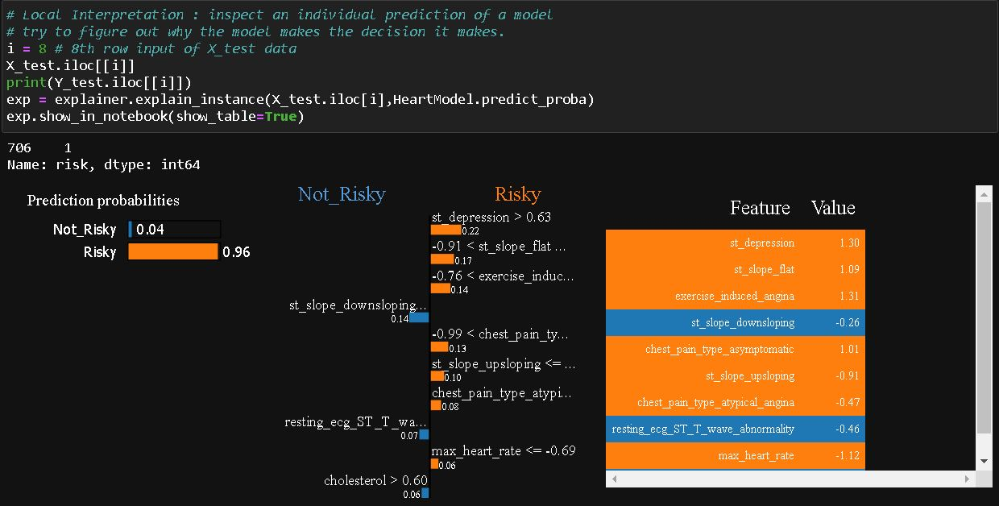
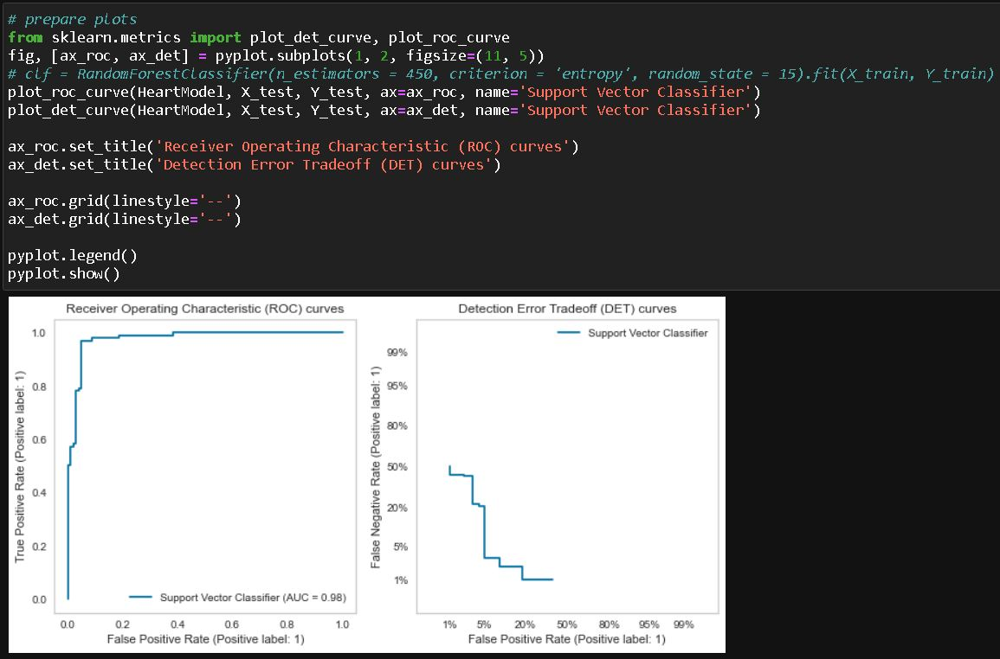
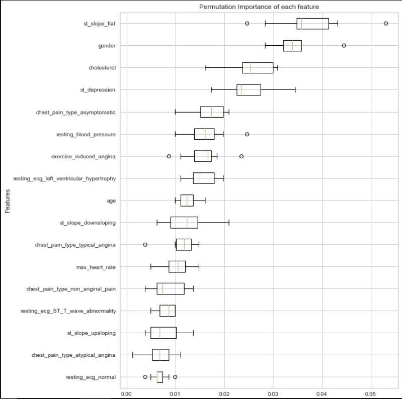

# Heart-Disease-Detection-With-LogisticRegression
Python Data Science Project, Heart Disease Detection using:

- LogisticRegression (94.08 % Accuracy)
- Support Vector Machine (96.05 % Accuracy)
- Decision Tree (94.08 % Accuracy)
- Random Forest (96.05 % Accuracy)
- AdaBoostClassifier (92.61 % Accuracy)
- GradientBoostingClassifier (95.07 % Accuracy)

For other Accuracy Details Please Check the Project. Other Accuracy Criterias are AUC & ROC Curve, Confusion Matrix, Classification Report, recall_score, precision_score etc.

## About Heart Disease
Heart Disease (including Coronary Heart Disease, Hypertension, and Stroke) remains the No. 1 cause of death in the US.The Heart Disease and Stroke Statistics—2019 Update from the **American Heart Association** indicates that:
* 116.4 million, or 46% of US adults are estimated to have hypertension. These are findings related to the new 2017 Hypertension Clinical Practice Guidelines.
* On average, someone dies of CVD every 38 seconds. About 2,303 deaths from CVD each day, based on 2016 data.
* On average, someone dies of a stroke every 3.70 minutes. About 389.4 deaths from stroke each day, based on 2016 data.

## Project Overview
In this Project I have unleashed the useful Data Science insights using this Heart_Disease dataset and performed the feature selection, feature engineering & missing data handling precisely to build Classification models. In this project I have used Classification Algorithms which are Logistic Regression. Logistic Regression Algorithm along with combining the power of best statistical rules & principles to maximise accuracy at its best followed by all statistical conditions. The best thing is my model is not having any Multicollinearity Problem. All features are fulfilling Statistically Significant concept respect to the target variable.

## About The Data
This dataset consists of 11 features and a target variable. It has 6 nominal variables and 5 numeric variables. The detailed description of all the features are as follows:

**1. Age:** Patients Age in years (Numeric) 
**2. Sex:** Gender of patient (Male - 1, Female - 0) (Nominal) 
**3. Chest Pain Type:** Type of chest pain experienced by patient categorized into 1 typical, 2 typical angina, 3 non-anginal pain, 4 asymptomatic (Nominal) 
**4. resting bp s:** Level of blood pressure at resting mode in mm/HG (Numerical) 
**5. cholestrol:** Serum cholestrol in mg/dl (Numeric) 
**6. fasting blood sugar:** Blood sugar levels on fasting > 120 mg/dl represents as 1 in case of true and 0 as false (Nominal) 
**7. resting ecg:** Result of electrocardiogram while at rest are represented in 3 distinct values 0 : Normal 1: Abnormality in ST-T wave 2: Left ventricular hypertrophy (Nominal) 
**8. max heart rate:** Maximum heart rate achieved (Numeric) 
**9. exercise angina:** Angina induced by exercise 0 depicting NO 1 depicting Yes (Nominal) 
**10. oldpeak:** Exercise induced ST-depression in comparison with the state of rest (Numeric) 
**11. ST slope:** ST segment measured in terms of slope during peak exercise 0: Normal 1: Upsloping 2: Flat 3: Downsloping (Nominal) 

#### Target variable
**12. target:** It is the target variable which we have to predict 1 means patient is suffering from heart risk and 0 means patient is normal.
